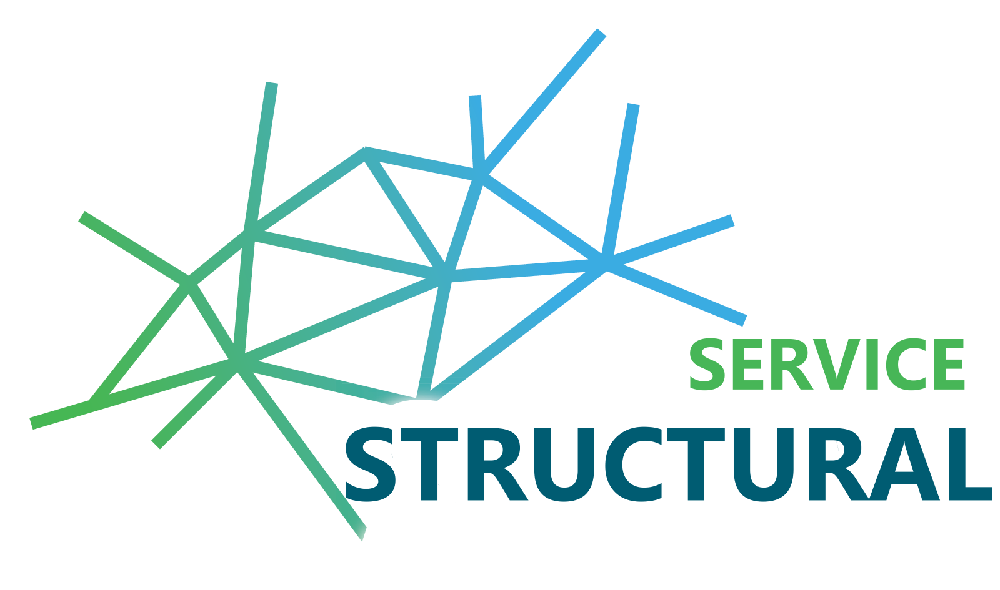

[)]()

# Structural Service

This service with its API create geometry objects for structural software. The Structural-Service is based on [FastAPI](https://fastapi.tiangolo.com/) and uses [pythonOCC](https://github.com/tpaviot/pythonocc-core) to operate with geometry objects.

# Prerequisites

* `Docker`
* `make` (optional)

or

* `conda`

# Start
## With Docker
The easiest way to start the service is with `make up`. For this you need make installed. You can also just use the docker-compose file to get your docker-container started.

If you want to use the service with `uvicorn` you can use `make up-prod`

## Without Docker
If you do not want to use Docker you can just create a virtual environment and install the requirements with conda. Make sure to add all the needed channels. For this you can also use the `make build-local` inside your virtual environment.

# API-Docs
Since this project is using FastAPI, there are automatically created documentations about the API. If the Server is running you can access them here : `http://localhost:8000/docs`.

A current version of the OpenAPI can be found in the folder [openAPI](/openAPI/structural-service.json).

# Testing
There are really simple tests which can be run with `make run-tests` inside the docker-container.

# Integration into Scope-Admin
You can integrate this service into the SCOPE-Service stack with the help of [SCOPE-Admin](https://github.com/projekt-scope/scope-admin)

# Background
This service is part of the research project [SCOPE](https://www.projekt-scope.de/). For more information about the microservice architecture see :

Huyeng, T.-J., Thiele, C.-D., Wagner, A., Shi, M., Hoffmann, A., Sprenger, W., Rüppel, U., 2020. An approach to process geometric and semantic information as open graph-based description using a microservice architecture on the example of structural data, in: Ungureanu, L.C., Hartmann, T. (Eds.), EG-ICE 2020 Workshop on Intelligent Computing in Engineering. Presented at the 27th EG-ICE International Workshop 2020, Universitätsverlag der TU Berlin, Berlin. https://doi.org/10.14279/depositonce-9977

# Contact
 [SCOPE](https://www.projekt-scope.de/)
<!-- ## TUDa -->

